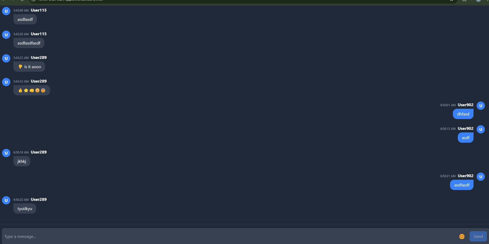

# This is a real-time chat web app

## Stack

```
TypeScript, Remix, Turso DB, WebSocket, Tailwind CSS, vite, eslint
```

## Runtime

```
Node 20 or later
```

## How to install project

```sh
git clone git@github.com:watcharasutthamnong/remix-turso-chat.git
cd remix-turso-chat
npm install
```

## How to start project

### 1. To start dev server
```sh
npm run dev
```

### 2. To start build and start the server
```sh
npm run build && npm run start
```

## Preview

